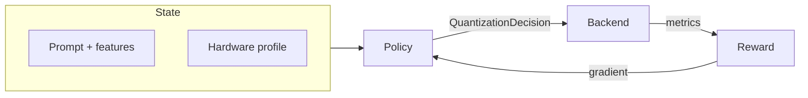

# Adaptive local llm Quantization with reinforcement learning using llama.cpp Link: (https://github.com/ggml-org/llama.cpp) (local open-source large language model optimization through reward engineering and learned policy)

## How it learns

Most deployments still treat quantization as a **one-time export**: pick a preset, ship it, hope it holds on every device and every prompt. This repo treats it as a **closed-loop control problem**: an agent observes **where the model runs** and **what it is asked to do**, then **acts**—bit widths, grouping, dynamic schedules, and (if enabled) **learned continuous controls** over scale, clip, and effective precision. The goal is not a single blessed `.gguf`; it is a **policy** you can train, evaluate, ablate, and (optionally) ground against a real [**llama.cpp**](https://github.com/ggml-org/llama.cpp)-class binary.

**Scope:** the core loop learns **quantization decisions** and evaluates them via the simulator and/or `llama.cpp`. It does **not** implement a general-purpose “quantize a PyTorch LLM in-place” layer-wrapping toolkit.

Each training step is a short RL episode:

1. **Reset** — `AdaptiveQuantizationEnv` samples a **prompt**, builds **hardware context** (GPU / CPU / low-resource profiles, optionally from **detected host hardware**), and extracts **input features** plus layer **sensitivity** estimates.
2. **Act** — the policy returns a `QuantizationDecision`: discrete **modes and bit widths**, optional **learned** scale/clip/effective precision, and (with MoE) **packed expert variants** under swap/cache/churn penalties.
3. **Measure** — a **backend** scores the choice (simulator by default; **`llama.cpp` + GGUF** or calibrated proxies when configured).
4. **Reward** — `compute_weighted_reward` combines latency, throughput, memory, perplexity/quality, **instability probes**, MoE terms, and any weights you set in config.
5. **Update** — policy-gradient learning on the reward; episodes append to **JSONL** under `outputs/logs/` for analysis and optional **hash-chained replay** audit.



**Default learner (stdlib):** `Trainer` + `UniversalQuantizationPolicy` — **categorical** mode head, **Gaussian** heads for continuous knobs, **value baseline**, **one-step / contextual-bandit-friendly** **REINFORCE-style** updates (fast, deterministic when configured, auditable).

**Optional learners:** `torch_trainer` + neural `torch_policy` on **CUDA** with **PPO**, **VPG**, or **AWR**; **online** continual adaptation (`adaptive-rl-quant-online`); **multi-seed** aggregation; **hyperparameter sweep** (`adaptive-rl-quant-sweep`); **in-run routing** (`routing.py`) when `router_enabled` picks among configured backends/model ids; **GGUF route catalogs** (`adaptive-rl-quant-route`) use a contextual **UCB1** bandit per hardware/domain/complexity bucket ([docs/ROUTES.md](docs/ROUTES.md)).

**What you can stress-test**

- **Universal vs narrow policies** — one controller trained across **GPU / CPU / low-resource** profiles, not a single silicon story.
- **Input adaptation** — prompt complexity and sensitivity change quantization behavior.
- **Beyond discrete menus** — **learned** modes map into safe ranges instead of freezing on named presets only.
- **MoE serving realism** — expert **variants**, swap/cache/churn penalties; action space reflects **systems constraints**.
- **Reward engineering** — compose latency, throughput, memory, quality, instability, MoE terms; no single hard-coded score.
- **Reproducibility** — JSON/TOML/Python `FrameworkConfig`, presets, seeds, sequential sampling, deterministic train/eval when you need an audit trail.

**End-to-end pipeline (same config surface for every backend):** train → evaluate → benchmark suite → analysis under **`outputs/`** (JSON, JSONL, inline SVG, optional Markdown reports, `paper_bundles/` for citation-style bundles). After benchmarks, runs can **detect host hardware** (safe static fallback when probing fails) and write an **RL-backed quantization recommendation** (`benchmarks/*_recommendation.json`).

**Evidence boundary:** headline quantitative stories in [docs/PAPER.md](docs/PAPER.md) target the **simulator-first** evidence base. The CUDA path supports real compute and host-grounded training but does not replace careful multi-machine measurement for deployment claims. This is **research infrastructure**, not a hosted inference API.

## Technology behind it

| Component | Role |
| --- | --- |
| **`AdaptiveQuantizationEnv`** | One-step RL interface: reset → act → backend → reward; MoE via `ExpertBank` when enabled |
| **`UniversalQuantizationPolicy`** | Stdlib policy: `CategoricalHead` + `GaussianHead` + `ValueHead` → `QuantizationDecision` |
| **`torch_policy` / `TorchTrainer`** | Neural policy + GPU trainers (checkpoints under `outputs/checkpoints/`) |
| **`SimulatorBackend`** | Default measurable world — CI-friendly, **no PyTorch** |
| **`LlamaCppBackend`** | Local **llama.cpp** binary + GGUF measurements; calibrate simulator via `adaptive-rl-quant-calibrate` |
| **`FrameworkConfig`** | Canonical experiment contract (JSON/TOML/Python); validation, presets, reproducibility knobs |
| **`research_pipeline.py`** | Orchestrates train, eval, benchmarks, analysis, reports |
| **`reward.py`**, **`guardrails.py`** | Weighted objectives and instability fallback |
| **`hardware.py`**, **`gpu_profiles.py`** | Runtime host detection vs training/simulator tuning tables |
| **`src/analysis/`** | Post-hoc analyzers on logged episodes (`adaptive-rl-quant-analyze`, `python -m analysis`) |
| **`replay_trace` / `adaptive-rl-quant-replay`** | Hash-chained JSONL integrity and re-verification |

| Execution mode | What you need |
| --- | --- |
| **Simulator (default)** | **Python ≥ 3.11**, `pip install -e .` — no PyPI runtime deps, no CUDA |
| **llama.cpp grounded** | Same + built **llama.cpp** binary and GGUF path in config (`backend="llama_cpp"`) |
| **PyTorch / CUDA** | Same repo + **CUDA-enabled PyTorch** on **Linux + NVIDIA** (`pip install -e ".[torch]"`, `adaptive-rl-quant-pytorch`) |

**Installed entrypoints (thin `run_*.py` shims at repo root match these):** `adaptive-rl-quant` (default simulator), `adaptive-rl-quant-moe`, `adaptive-rl-quant-pytorch`, `adaptive-rl-quant-online`, `adaptive-rl-quant-multiseed`, `adaptive-rl-quant-sweep`, `adaptive-rl-quant-calibrate`, `adaptive-rl-quant-route`, `adaptive-rl-quant-replay`, `adaptive-rl-quant-analyze`.

**Artifacts:** one layout under **`outputs/`** — `logs/` (JSONL), `benchmarks/`, `analysis/<run_name>/`, `checkpoints/`, `reports/`, `paper_bundles/` — regardless of backend ([Outputs](#outputs)).

**Stack:** Python ≥ 3.11, stdlib-first RL, optional **`[torch]`** for NVIDIA, [**llama.cpp**](https://github.com/ggml-org/llama.cpp) for local GGUF inference research, hash-chained replay for audit. **Linux / WSL2** is the default for CUDA and `llama.cpp`; simulator also runs on **macOS** and **native Windows**.

Further detail: [docs/ARCHITECTURE.md](docs/ARCHITECTURE.md) · [docs/PAPER.md](docs/PAPER.md) · [docs/RUNNING.md](docs/RUNNING.md) · [docs/CONFIG.md](docs/CONFIG.md).

[](https://github.com/Legendarylibrorg/Adaptive-RL-Quantization/actions/workflows/ci.yml) **Contributing:** [CONTRIBUTING.md](CONTRIBUTING.md) · **Support:** [SUPPORT.md](SUPPORT.md) · **Changelog:** [CHANGELOG.md](CHANGELOG.md) · **Code of Conduct:** [CODE_OF_CONDUCT.md](CODE_OF_CONDUCT.md) · **Security:** [SECURITY.md](SECURITY.md) · **Report a vulnerability:** [private advisory](https://github.com/Legendarylibrorg/Adaptive-RL-Quantization/security/advisories/new)

## Quick start

**Linux-first:** CUDA, `llama.cpp`, and the Makefile targets are designed for **Linux**. Use the path below on a fresh **Linux** machine (or **WSL2 Ubuntu** on Windows — same commands inside the Linux shell). **macOS** can run the simulator path the same way; **native Windows** is supported for the simulator via `setup.bat` (GPU work should use WSL2).

**Needs:** `git` and **Python ≥ 3.11**. No GPU or PyTorch required for the default simulator run.

### Linux (recommended)

```bash
git clone https://github.com/Legendarylibrorg/Adaptive-RL-Quantization.git
cd Adaptive-RL-Quantization
./setup.sh && ./run
```

`./setup.sh` creates `.venv`, installs the package, runs tests, and runs a short end-to-end smoke (`config.e2e_smoke.json`). `./run` starts a **full** simulator experiment (uses `.venv/bin/adaptive-rl-quant` when present). No need to `activate` the venv or rerun smoke.

**No install yet?** From a source checkout you can still smoke-test immediately:

```bash
python3 run_research.py --config config.e2e_smoke.json
```

| Linux option | Command |
| --- | --- |
| Install only (no tests/smoke) | `./setup.sh --quick` |
| After setup, without venv paths | `source .venv/bin/activate` then `adaptive-rl-quant` or `./run` |
| Makefile (uses `.venv` when present) | `make run` |
| CI-equivalent smoke | `make reproduce` or `adaptive-rl-quant --config config.e2e_smoke.json` |
| CUDA / PyTorch (after setup) | see [GPU and platform notes](#gpu-and-platform-notes) below |

### macOS (simulator)

Same as Linux: `./setup.sh` then `.venv/bin/adaptive-rl-quant`. GPU/CUDA training is not the primary target on macOS.

### Windows

| Path | Command |
| --- | --- |
| **WSL2 (Ubuntu)** — recommended for Linux parity, CUDA, Makefile | Same as [Linux](#linux-recommended) inside WSL |
| Native Windows (simulator) | `setup.bat` then `.venv\Scripts\adaptive-rl-quant` |

More: [docs/INSTALL.md](docs/INSTALL.md) · [docs/RUNNING.md](docs/RUNNING.md) · [docs/ARCHITECTURE.md](docs/ARCHITECTURE.md) (Linux-first / WSL2 guidance).

---

### Install and dev (quick reference)

**Install (after activating a venv):** `python3 -m pip install -e .`. GPU training: `python3 -m pip install -e ".[torch]"` or install a matching [torch](https://pytorch.org/get-started/locally/) wheel first, then `python3 -m pip install -e .`. On Windows, substitute `py -3.11 -m pip` or `python -m pip`.

**Daily dev (optional):** `python3 -m pip install -e ".[dev]"` then `make help` on Linux/macOS, or `python3 scripts/pre_commit_check.py` on Unix-like hosts (`py -3.11` / `python` on Windows). See [CONTRIBUTING.md](CONTRIBUTING.md).

**Dependency hardening:** CI bootstrap packages live in **`requirements/ci.txt`** and install with **`pip --require-hashes`** after [scripts/verify_hashes.py](scripts/verify_hashes.py) checks **`security/dependency_hashes.json`**. **Dependabot** watches **`pyproject.toml`** and **`requirements/`**.

Learning loop, backends, and commands: [How it learns](#how-it-learns) · [Technology behind it](#technology-behind-it) · [Public Commands](#public-commands).

---

## GPU and platform notes

**CUDA (Linux + NVIDIA):** after `./setup.sh`, install PyTorch for your driver, then:

```bash
.venv/bin/python -m pip install -e ".[torch]"
.venv/bin/adaptive-rl-quant-pytorch --preset gpu
```

**RTX 4090 one-shot (Linux):** `bash scripts/run_4090_pipeline.sh`

Distro packages, **WSL2**, SSH clone, llama.cpp, manual venv steps: **[docs/INSTALL.md](docs/INSTALL.md)**. Architecture: **[docs/ARCHITECTURE.md](docs/ARCHITECTURE.md)**.

Artifacts land under **`outputs/`** (see [Outputs](#outputs) below).

---

## Repository layout

| Path | Role |
| --- | --- |
| `src/` | **Packaged source layout** (`src/adaptive_quant/`, `src/analysis/`, `src/config*.py`) |
| `src/adaptive_quant/` | Core library: env, trainers, policies, backends, CLI under **`cli/`**, **`easy_config.py`**, presets under **`presets/`** |
| `src/config.py` | Python experiment presets (`CONFIG`, `CONFIG_GPU`, …; also `adaptive_quant.presets` after `pip install -e .`) |
| `config.example.json` | Example **JSON** config (`preset` + overrides) |
| `config.e2e_smoke.json` | **Short reproducible RL run** (train+eval+benchmarks+analysis) for CI and quick tuning |
| `config.sweep.example.json` | Example **hyperparameter sweep** grid (`base_config` + `grid` + objective) |
| `config.example.pytorch.toml` | Example **TOML** for `run_pytorch.py --config` (needs CUDA PyTorch) |
| `run` (repo root) | One-command default run after setup (`./run`; uses venv CLI when present) |
| `run_*.py` (repo root) | Thin shims (prepend `src/` to `sys.path`) matching the installed console commands |
| `setup.sh`, `setup.bat` | **One-command bootstrap** from repo root (venv + install + tests + smoke) |
| `Makefile` | **Research** targets: `make help` — `setup` / `run` / `reproduce` (`smoke`) / `multiseed` / `sweep` / `pytorch`; quality: `lint` / `format` / `check` (Ruff needs `pip install -e ".[dev]"`) |
| `scripts/` | Cross-platform **`setup_from_clone.py`**, **`pre_commit_check.py`**, **`secret_scan.py`**, **`run_4090_pipeline.sh`**, **`_resolve_venv_python.sh`** |
| `requirements/ci.txt` + `security/dependency_hashes.json` | Pinned CI bootstrap dependencies plus the separate sha256 manifest used to render a `--require-hashes` install file |
| `src/analysis/` | Post-hoc analyzers (`python -m analysis`) |
| `docs/` | Install, running, config reference, troubleshooting |
| `CONTRIBUTING.md` | Contributing policy, PR expectations, local quality gate |
| `CHANGELOG.md`, `RELEASING.md` | Version history and release process |
| `CITATION.cff` | Software citation (for papers and “Cite this repository”) |
| `CODE_OF_CONDUCT.md` | Short rules for issues and pull requests |
| `SECURITY.md` | Vulnerability reporting (private disclosure, scope, SLAs, safe harbor) |
| `SUPPORT.md` | Where to ask for help and how to file a useful bug |
| `.well-known/security.txt` | Machine-readable disclosure metadata (RFC 9116) |
| `.github/workflows/` | CI (Linux on Python 3.11/3.12/3.13; macOS and Windows on 3.12; E2E smoke) |
| `.github/ISSUE_TEMPLATE/` | Bug report and feature issue forms |
| `.github/PULL_REQUEST_TEMPLATE.md` | Default PR checklist |
| `.github/CODEOWNERS` | Reviewer routing for security-sensitive paths |
| `tests/` | `unittest` suite (no GPU required) |

---

## Configuration

**1. Python presets** — Edit or copy `src/config.py` (exports `CONFIG`, `CONFIG_GPU`, `CONFIG_MOE`, …) or use `adaptive_quant.presets` in code. After `pip install -e .`, `from config import CONFIG` still works. This is the default when you do **not** pass `--config`.

**2. JSON / TOML** — Copy **`config.example.json`**, or write a `.toml` file with the same keys. Optional top-level **`preset`**: `default`, `minimal`, `pytorch`, `reproducible`. A file passed with `--config` replaces the Python preset selected by the entrypoint; put `preset` inside the JSON/TOML when you want layering. Config paths and default artifact directories such as `outputs/` are resolved relative to the current working directory, so run these commands from the repository root or use absolute paths.
Load from the installed CLI:

```bash
adaptive-rl-quant --config my_settings.json
adaptive-rl-quant -c my_settings.toml
adaptive-rl-quant-pytorch --config cuda_run.toml    # replaces --preset
```

Source-checkout equivalents remain `python3 run_research.py --config ...` and `python3 run_pytorch.py --config ...`.

Programmatically: `FrameworkConfig.from_file("path.json")`, `load_config()` from `adaptive_quant`, or `FrameworkConfig.from_mapping({...})`. See **[docs/CONFIG.md](docs/CONFIG.md)**.

**3. Reproducible research preset** — `FrameworkConfig.reproducible_research(seed=...)` or JSON `"preset": "reproducible"` turns on sequential env sampling, deterministic train policy, deterministic stability probes, and PyTorch deterministic mode when applicable.

---

## Public Commands

| Goal | Command |
| --- | --- |
| Default offline run (simulator, no PyTorch) | `adaptive-rl-quant` |
| Fast E2E RL smoke (edit `config.e2e_smoke.json`) | `adaptive-rl-quant --config config.e2e_smoke.json` |
| Same with your own file | `adaptive-rl-quant --config path.json` |
| MoE preset | `adaptive-rl-quant-moe` |
| NVIDIA GPU (auto VRAM profile) | `adaptive-rl-quant-pytorch --preset gpu` |
| RTX 3090 preset | `adaptive-rl-quant-pytorch --preset 3090` (or `make 3090`) |
| RTX 4090 preset | `adaptive-rl-quant-pytorch --preset 4090` |
| 4090 checks + unittest + run | `bash scripts/run_4090_pipeline.sh` |
| Multi-seed aggregation | `adaptive-rl-quant-multiseed --preset dense --seeds 13,17,23` |
| Hyperparameter sweep | `adaptive-rl-quant-sweep --sweep-config config.sweep.example.json` |
| Calibrate simulator from llama.cpp | `adaptive-rl-quant-calibrate` (binary + model in config) |
| GGUF route catalog + contextual bandit | `adaptive-rl-quant-route --catalog outputs/routes/catalog.json seed` |
| Online / continual experiment | `adaptive-rl-quant-online` |
| Post-hoc log / history analysis | `adaptive-rl-quant-analyze` or `python -m analysis` |
| Hash-chain replay / audit verify | `adaptive-rl-quant-replay --config <file>` |

Full descriptions: **[docs/RUNNING.md](docs/RUNNING.md)**. Pass **`--help`** on any installed command for `-c` / `--config`. Source-checkout equivalents remain available as `python3 run_*.py`.

**Verify the install:**

```bash
adaptive-rl-quant --help
adaptive-rl-quant-online --help
adaptive-rl-quant-pytorch --help
adaptive-rl-quant-multiseed --help
adaptive-rl-quant-sweep --help
adaptive-rl-quant-calibrate --help
adaptive-rl-quant-route --help
adaptive-rl-quant-replay --help
python3 -m unittest discover -s tests -t . -q
```

---

## Outputs

Under **`outputs/`**:

- `logs/` — JSONL episodes
- `benchmarks/` — summaries, optional `*_preflight.json` (GPU)
- `benchmarks/*_recommendation.json` — detected hardware + adaptive-policy summary + best fixed quant candidate sourced from RL rollouts
- `analysis/<run_name>/` — JSON + figures
- `checkpoints/` — policy checkpoints (PyTorch)
- `reports/` — Markdown reports
- `paper_bundles/<run_name>/` — manifest, metric CSV/JSON, flattened telemetry, appendix, and claims validation for citation/review

Paths are driven by `run_name` and directory fields in config.

---

## Security

- **Report vulnerabilities** privately via [GitHub Security Advisories](https://github.com/Legendarylibrorg/Adaptive-RL-Quantization/security/advisories/new); details in [SECURITY.md](SECURITY.md) and [`.well-known/security.txt`](.well-known/security.txt).
- **Stronger isolation (recommended for untrusted artifacts):** **disposable Linux VM → hardened Docker** (optional **NVIDIA GPU inside the VM** via passthrough + container runtime). Convenience host venv is lower assurance — see **[docs/SECURE_RUN.md](docs/SECURE_RUN.md)**; locally use `make docker-preflight`, `make docker-gpu-verify` (GPU VM).
- **Secrets / checkpoints / CI hashes:** do not commit `.env` or keys; treat third-party **`.pt`** checkpoints as untrusted (loaders use **`weights_only=True`** where supported); CI installs bootstrap deps with **`pip --require-hashes`** after [scripts/verify_hashes.py](scripts/verify_hashes.py). Secret scan: **`scripts/secret_scan.py`** via **`pre_commit_check.py`**.

---

## Documentation index

| Doc | Contents |
| --- | --- |
| [docs/INSTALL.md](docs/INSTALL.md) | Cross-platform venv setup, optional `[torch]`, llama.cpp |
| [docs/SECURE_RUN.md](docs/SECURE_RUN.md) | VM + Docker isolation tiers, NVIDIA in VM, hardened Compose |
| [docs/ARCHITECTURE.md](docs/ARCHITECTURE.md) | Repo layering, artifact contract, Linux-first / WSL2 guidance |
| [docs/RUNNING.md](docs/RUNNING.md) | Every entrypoint, examples, OS notes |
| [docs/CONFIG.md](docs/CONFIG.md) | All settings + **JSON/TOML** + reproducibility |
| [docs/USAGE.md](docs/USAGE.md) | Artifacts, API, re-running analysis |
| [docs/GPU_PROFILES.md](docs/GPU_PROFILES.md) | VRAM / preset table |
| [docs/TROUBLESHOOTING.md](docs/TROUBLESHOOTING.md) | CUDA / preflight |
| [docs/ONLINE.md](docs/ONLINE.md) | Online loop |
| [docs/ROUTES.md](docs/ROUTES.md) | GGUF route catalogs and contextual route bandits |
| [docs/LOCAL_RESEARCH.md](docs/LOCAL_RESEARCH.md) | Local `llama.cpp` evidence and paper bundles |
| [docs/PAPER.md](docs/PAPER.md) | Research summary |
| [CHANGELOG.md](CHANGELOG.md) | Version history |
| [RELEASING.md](RELEASING.md) | Tags and optional PyPI release |
| [CITATION.cff](CITATION.cff) | Citation metadata (GitHub “Cite this repository”) |
